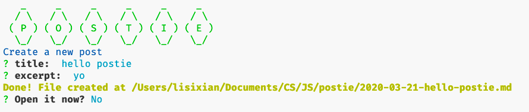
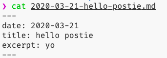

# Postie

A handy tool to create metadata for your markdown blog posts.


## Why the name

It sounds cute.

## Installation

### Global

`yarn global add @deerhound/postie` **OR**

`npm install -g @deerhound/postie`

Then you can run `postie` in your command line.

### Local

`yarn add @deerhound/postie` **OR**

`npm install @deerhound/postie`

Run with

`yarn postie` **OR**

`npx postie`

## Usage

```
postie

Options:
  --template, -t  Create file with a specific template
  --path, -p      Output directory for markdown files
  --help, -h      Show help
```

**NOTE** Make sure the template used in `postie -t [TEMPLATE]` exists. You can use `postie template -l` to list all templates.

```
postie template

Create a new template

Options:
  --list, -l  List all templates
  --import, -i  Create template from a javascript file
  --help, -h  Show help
```

```
postie config

Open the configuration file

Options:
  --path, -p   Default output path for markdown files created
  --list, -l   List all configs
  --clear, -c  Clear all configs
  --help, -h   Show help
```

## Create Template

### Create a simple template with `postie new template`


### Format of the template file

Postie asks questions with the help of [ Inquirer.js ](https://github.com/sboudrias/inquirer.js/). And the template for your metadata is generated from your questions. For example, based on `questions` below, Postie will prompt you to fill in `title` and `excerpt`.

```javascript
const questions = [
  {
    name: "title",
    type: "input",
    message: "title: "
  },
  {
    name: "excerpt",
    type: "input",
    message: "excerpt: "
  }
];
```





After you run `postie template`, Postie will open the editor, and you should create a question **array** following the format above.

### More complicated

Check out the [example](https://github.com/Deerhound579/postie/blob/master/lib/templates/mytemp.js).
You can write your own file and import it with `postie template -i /path/to/your/file`.

For all possible prompt types, please see [doc for Inquirer.js](https://github.com/SBoudrias/Inquirer.js/#prompt-types).
